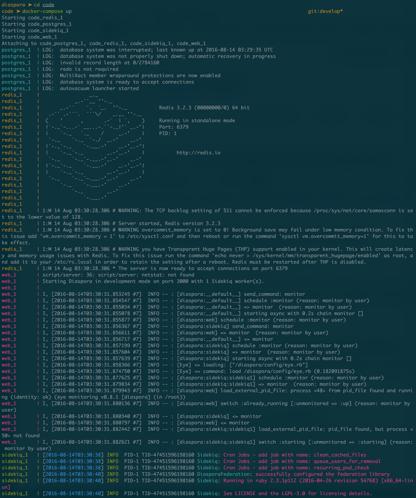

A quick setup to get started contributing to diaspora\* with docker-compose.

# Installation

- Clone the diapora repository: `git clone git@github.com:diaspora/diaspora.git`.
- Copy the Dockerfile and docker-compose.yml at the root of the repo.
- Have git ignore these files without touching diaspora’s .gitignore by adding to .git/info/exclude:
```
Dockerfile
docker-compose.yml
```
Edit config/database.yml with the following info for postgres:
```
host: postgres¬
port: 5432¬
username: diaspora¬
password: diaspora¬
```

Edit config/diaspora.yml to setup redis and have jobs work in a seperate process.
```
...
single_process_mode: false
...
redis: 'redis://redis'
```

Run `docker-compose build`.
If everything went smoothly, prepare diaspora:

```
$ docker-compose run --rm web /bin/bash -c 'bundle exec rake generate:secret_token && \
                                          bundle exec rake db:create && \
                                          bundle exec rake db:migrate && \
                                          bundle exec rake db:test:prepare && \
                                          bundle exec rake assets:generate_error_pages && \
                                          rspec'
```

If the tests all pass (they should), you now have a functional diaspora pod.
Run the diaspora server with: `docker-compose up`.


